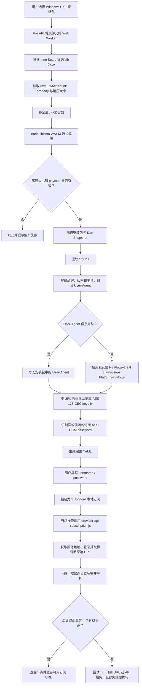
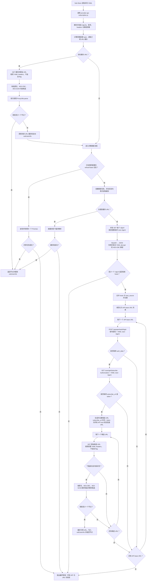
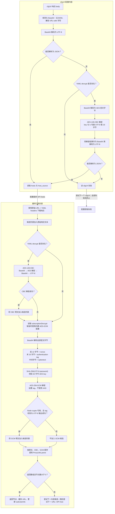

# sub cfg export

一个纯浏览器、纯静态的封端机场客户端配置提取工具，配合 Sub-Store 可获得订阅节点。

工具界面有详细的使用引导：<https://alecthw.github.io/sub-cfg-export/>

用户选择 Windows EXE 安装包后，程序会在本地解析 Inno Setup 的 LZMA2 数据、扫描配置 URL，并在存在时提取 decrypt key/iv，最后生成完整 YAML。

文件不会上传，也不需要后台服务，可直接部署到 GitHub Pages。

## 输出格式

```yaml
cfgUrls:
  - https://example.com/config.json

username:
password:
headers:
  User-Agent: NetFlow/v3.0.6 clash-verge Platform/linux
decrypt:
  key: 0123456789abcdef
  iv: fedcba9876543210
subscriptionDecrypt:
  type: aes-256-gcm
  password: 86f2e72ead6e985e
```

找不到 key/iv 时 `decrypt` 输出 `null`；未识别到订阅 AES-GCM 口令时不输出 `subscriptionDecrypt`：

```yaml
decrypt: null
```

## 完整调用与解密流程

### 1. 从安装包到 Sub-Store 节点



浏览器侧只负责读取安装包并生成 YAML，不上传文件。网络请求和订阅解密发生在执行脚本的 Sub-Store 后端中。

### 2. Sub-Store API 完整调用链



服务地址规范化规则为：已经以 `/api/v1` 结尾的地址直接使用；以 `/api` 结尾的地址依次尝试原地址和 `/api/v1`；其余地址追加 `/api/v1`。`token` 回退地址固定为 `API host/client/subscribe?token=...`。所有最终订阅请求均使用 YAML `headers` 中的 `User-Agent`，不会追加 `flag=clash-verge` 或 `flag=clash`。

### 3. 配置与订阅解密分支



两组解密参数彼此独立：

- `decrypt.key` / `decrypt.iv` 使用 **AES-128-CBC**，既可解密加密的 `cfgUrl` 配置，也可生成最终订阅的 CBC 解密候选。两者虽然通常长得像 16 位十六进制字符串，代码实际按 UTF-8 字符串取 16 字节，并非按 hex 转换成 8 字节。
- `subscriptionDecrypt.password` 使用 **AES-256-GCM**，只用于最终订阅。密文布局为 `Base64(nonce[12] + ciphertext + tag[16])`，密钥为 `SHA-256(UTF-8(password))`，不使用 AAD。未输出该字段时，脚本会使用内置口令 `86f2e72ead6e985e` 作为兼容回退。
- 每种解密失败只会丢弃对应候选；原文、CBC 和 GCM 候选按顺序独立交给 `ProxyUtils.parse()`，其中任一候选解析出非空节点数组即成功。
- CBC 与 GCM 均通过 Node.js `crypto` 实现，因此需要运行在 Node.js 后端版 Sub-Store；非 Node.js 运行环境仍可尝试解析无需解密的原始订阅内容。

## 技术方案

- React 19 + Ant Design 6
- Vite 8 + TypeScript 7
- Web Worker 内解析，避免阻塞页面
- `node-liblzma` 提供非线程 liblzma WebAssembly
- File API 本地读取，Blob API 下载 YAML

Inno Setup 内保存的是 raw LZMA2 数据。解析器先读取 LZMA2 chunk 边界与解压大小，再在内存中补成最小 XZ 容器，交给 liblzma WASM 流式解压。liblzma 源码不复制进本项目，由 npm 依赖管理。

## 本地开发

需要 Node.js 22 或更高版本，推荐 Node.js 24。

```bash
npm install
npm run dev
```

生产构建与预览：

```bash
npm run build
npm run preview
```

真实样本端到端测试：

```bash
npx playwright install chromium
npm run test:e2e
```

测试默认读取项目根目录中的：

- `globalcloud-2.2.3-windows-amd64-setup.exe`
- `xmtzapp-lite.exe`

EXE 与生成的 YAML 已加入 `.gitignore`，不会被默认提交。

## GitHub Pages 部署

项目已包含 `.github/workflows/deploy-pages.yml`。将仓库推送到 `main` 后：

1. Workflow 会执行 `npm ci` 和 `npm run build`。
2. 构建结果 `dist/` 会以 orphan commit 发布到 `gh-pages` 分支。
3. 在 GitHub 仓库的 Settings → Pages 中选择 **Deploy from a branch**，分支选择 `gh-pages`，目录选择 `/ (root)`。

也可以在 Actions 页面手动运行 `Deploy GitHub Pages` Workflow。Vite 使用相对 `base`，因此兼容 GitHub Pages 的项目子路径。

## 支持范围与安全限制

- 当前支持包含 `zlb\x1a` Inno Setup raw LZMA2 数据块的兼容安装包。
- 输入仅接受 `.exe`，页面限制为 512 MiB。
- 解压与扫描均在 Worker 中完成；浏览器内存不足时会返回错误，不会上传或回传安装包内容。
- URL 仅选择 HTTP/HTTPS 的 JSON 地址；key/iv 仅在可确认的 Dart Snapshot 邻近数据中输出。

## 第三方组件

liblzma WASM 由 [`node-liblzma`](https://github.com/oorabona/node-liblzma) 提供，其许可证为 LGPL-3.0。详见 [THIRD_PARTY_NOTICES.md](./THIRD_PARTY_NOTICES.md)。
